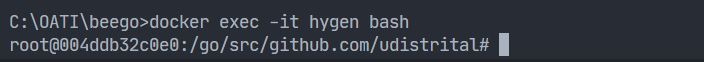
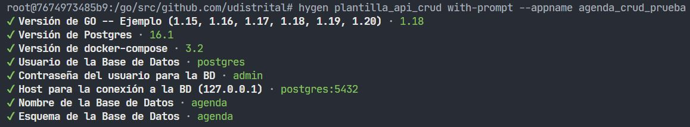
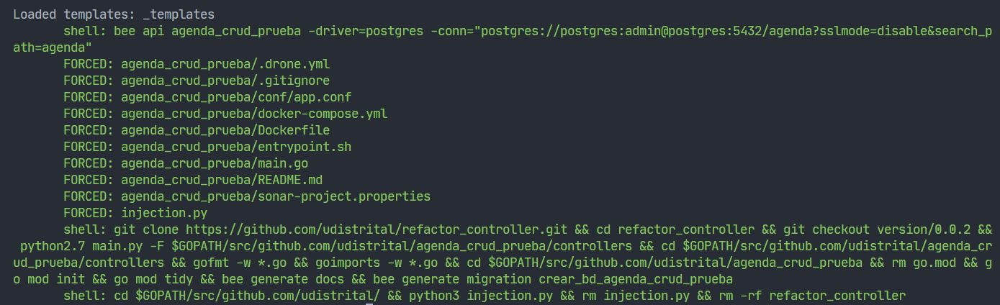
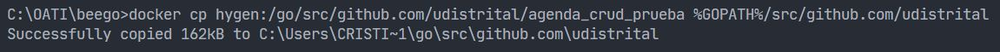

## Generar API CRUD - Hygen

Una vez los contenedores se crearon y están ejecutándose se realiza:

- ### Entrar al contenedor de docker

  - Ejecute el siguiente comando:

  ```bash
  docker exec -it hygen bash
  ```

  

- ### Crear API Crud (edite "nombre_api_crud")

  - Ejecute el siguiente comando:

  ```bash
  hygen plantilla_api_crud with-prompt --appname nombre_api_crud
  ```

  - Ingrese la configuración correspondiente a la versión de Go, versión de base de datos, credenciales de usuario y base de datos. **(Leer notas al final del readme)**.

  

  - Esta sería la vista de la creación correcta de la **API CRUD**:

  

- ### Salir del contenedor

  ```bash
  exit
  ```

- ### Copiar proyecto del contenedor al PC anfitrión en Windows (edite "nombre_api_crud")

  Si el primer comando no funciona, ejecutar el segundo:

  **1. Primer Comando**

  ```bash
  docker cp hygen:/go/src/github.com/udistrital/nombre_api_crud $GOPATH/src/github.com/udistrital
  ```

  **2. Segundo Comando**

  ```bash
  docker cp hygen:/go/src/github.com/udistrital/nombre_api_crud %GOPATH%/src/github.com/udistrital
  ```

  - Esta sería la vista de la copia correcta de la **API CRUD**:

  

  De esta forma ya tendremos la **API CRUD** creada en nuestro _workdir_ de Go.

- ### Cambiar tipos de datos en los modelos:

  Especificar el id `auto` y cambiar el tipo de dato `time.Time` a `string` en los atributos _fecha_creacion_ y _fecha_modificacion_.

- ### Modificar fechas de creación/modificación en los controladores y modelos:

  Importar en cada controlador la siguiente biblioteca:
  `"github.com/udistrital/utils_oas/time_bogota"`

  Colocar las siguientes líneas de código:

  - #### Para método HTTP POST:

  ```golang
  v.FechaCreacion = time_bogota.TiempoBogotaFormato()
  v.FechaModificacion = time_bogota.TiempoBogotaFormato()
  ```

  - #### Para método HTTP PUT (Editar un registro):

  **En el Controlador:**

  ```golang
  v.FechaModificacion = time_bogota.TiempoBogotaFormato()
  ```

  **En el Modelo en método _UpdateContactoById_:**

  ```golang
  m.FechaCreacion = time_bogota.TiempoCorreccionFormato(v.FechaCreacion)
  ```

## Notas importantes:

- Todos los pasos efectuados por consola se realizaron por _**CMD**_, aunque también fueron probados en _**Bash**_.
- Dentro del archivo `docker-compose.yaml` se estableció la versión **16.1** de **PostgreSQL**.
- Dentro del archivo `docker-compose.yaml` se establecieron las variables de entorno asociadas a **PostgreSQL** con su respectivo valor para el acceso a la base de datos (Consultarlos ya que son necesarios para la creación de la API CRUD).
- Cuando se pida el host para asociar la API CRUD a la BD se debe colocar: `postgres:5432`, de esta forma se está haciendo referencia al contenedor y puerto de postgres que está en la misma red de contenedores.
- Es posible también usar pgAdmin apuntando al puerto 5050 `http://localhost:5050` de la máquina anfitriona para insertar el modelo relacional y crear la API CRUD a partir de dicho modelo.
- Los datos de la base de datos persisten ya que se configuró así en el `docker-compose.yaml` así que al bajar el contenedor y subirlo nuevamente, no se perderán los datos de la BD.
