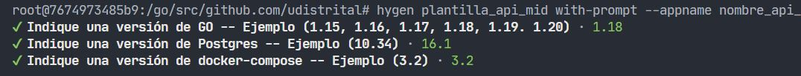
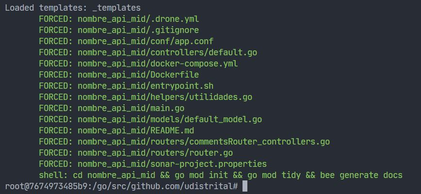
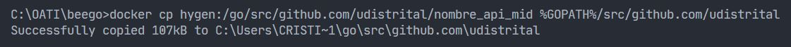

## Generar API MID - Hygen

- ### Entrar al contenedor de docker

  - Ejecute el siguiente comando:

  ```bash
  docker exec -it hygen bash
  ```

  

- ### Crear API Mid (edite "nombre_api_mid")

  - Ejecute el siguiente comando:

  ```bash
  hygen plantilla_api_mid with-prompt --appname nombre_api_mid
  ```

  - Ingrese la configuración correspondiente a la versión de Go, versión de base de datos, etc.

  

  - Esta sería la vista de la creación correcta de la **API MID**:
    

- ### Salir del contenedor

  ```bash
  exit
  ```

- ### Copiar proyecto del contenedor al PC anfitrión en Windows (edite "nombre_api_crud")

  Si el primer comando no funciona, ejecutar el segundo:

  **1. Primer Comando**

  ```bash
  docker cp hygen:/go/src/github.com/udistrital/nombre_api_mid $GOPATH/src/github.com/udistrital
  ```

  **2. Segundo Comando**

  ```bash
  docker cp hygen:/go/src/github.com/udistrital/nombre_api_mid %GOPATH%/src/github.com/udistrital
  ```

  - Esta sería la vista de la copia correcta de la **API MID**:
    

  De esta forma ya tendremos la **API MID** creada en nuestro _workdir_ de Go.
